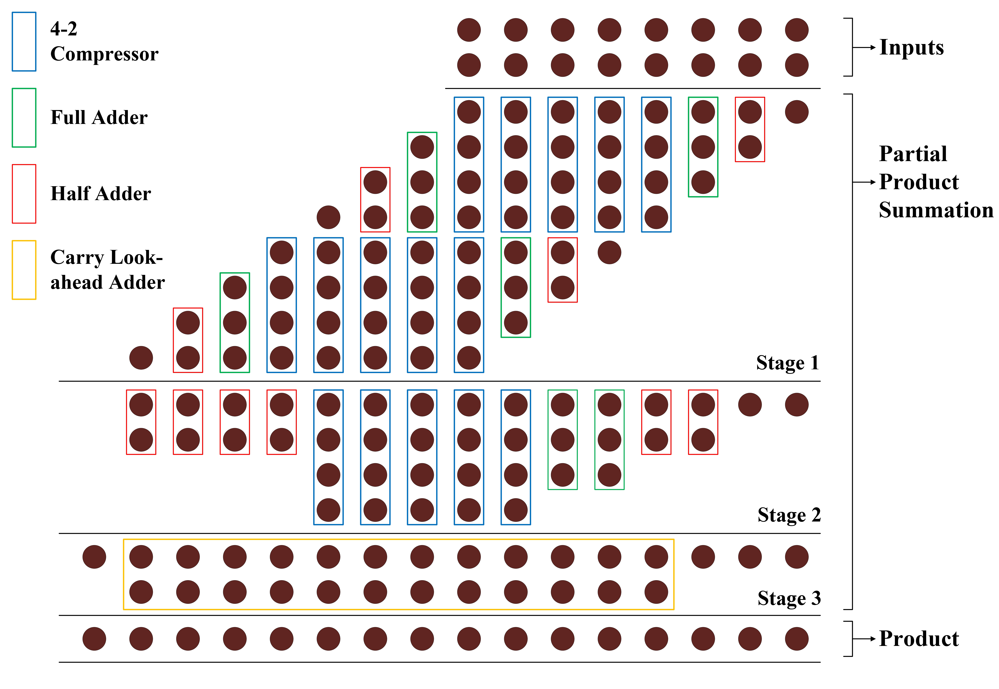
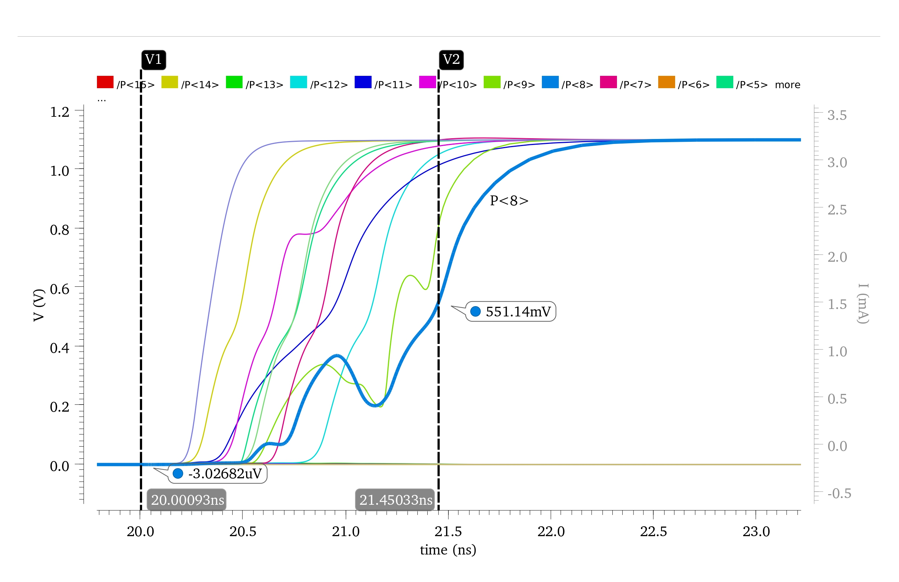
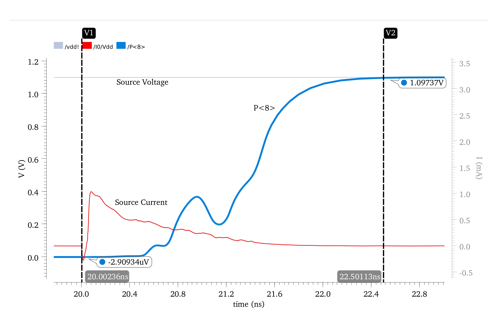
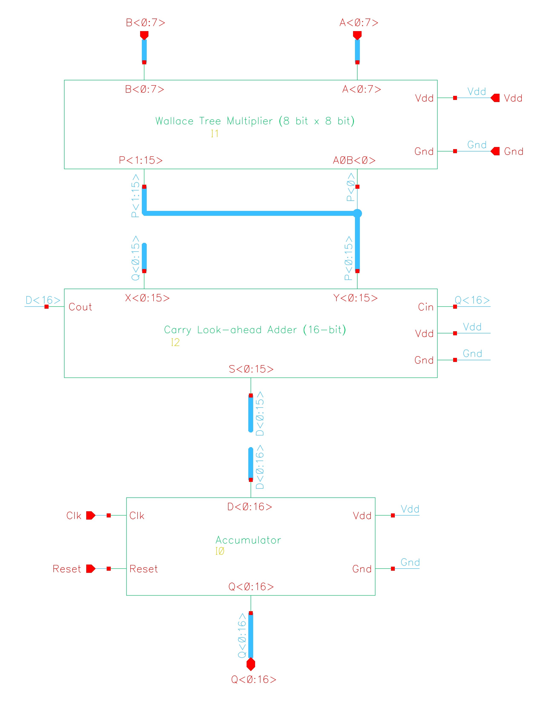
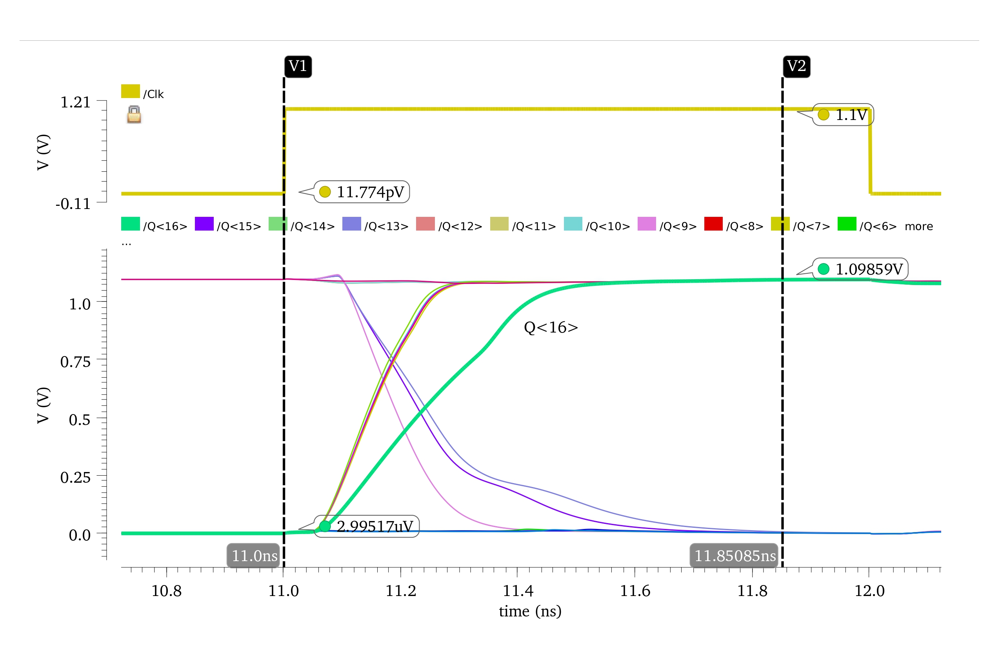
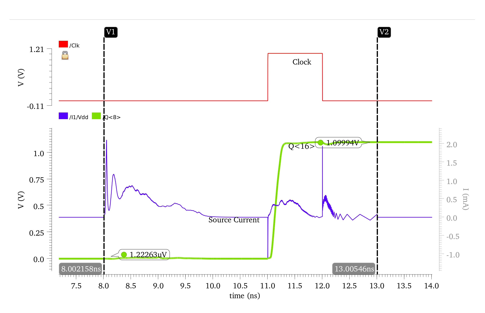

# 8-bit-Wallace-Tree-Multiplier-with-MAC-Module
## Implementation of an 8-bit Wallace Tree Multiplier and a Multiply-and-Accumulate (MAC) module using 45nm CMOS technology in Cadence Virtuoso.
## Wallace-Tree-Multiplier-with-MAC-module
This repository contains the implementation of an 8 bit Wallace tree multiplier along with a Multiply-Accumulate module in Cadence Virtuoso.

Navigate to the file [Project_Report_EEE559.pdf](https://github.com/Adrija-debug/Wallace-Tree-Multiplier-with-MAC-module/blob/main/Project_Report_EEE559.pdf) for more details.

## Circuit Diagram

## Latency, Energy and Area Analysis

### Worst Case Propagation Delay and Corresponding Input

The propagation delay is measured for the time taken by the input to transition to 50% of $V_{dd}$ to the time taken by the output to stabilize to 50% of $V_{dd}$. The worst-case propagation delay depends on several factors like the critical path for the output signal, transistor sizing, layout implementation, parasitic capacitance and resistance extracted from the layout, interconnect capacitance and resistance, power supply, signal crosstalk, and so on.

 

The maximum propagation delay of our Wallace tree multiplier arises from the output bit $P(8)$ as shown clearly in above graph. We can also see from Wallace tree architecture that $P(8)$ occurs approximately in the middle of our Wallace tree architecture, hence it typically encounters the most number of carries and additions due to overlapping partial products. The bit $P(8)$ becomes high for the input $A = 157$ and $B = 156$. The maximum delay for this combination is $1.42482~ns$.

### Energy Analysis

Using our worst-case input pair having $A = 157$ and $B = 156$, we calculate the maximum energy consumption for our design, which comes out to be around **$609.038~fJ$**, as verified from below graph.

### Layout and Total Area

The layout of the Wallace tree multiplier circuit is shown below. The total area of our layout is approximately **$1916.571525~\mu m^2$**.

Our layout has successfully passed DRC and LVS checks. After designing the layout, we perform parasitic extraction for energy and latency analysis.

---

## Summary of Results for Wallace Tree Multiplier

A summary of our Energy-Delay-Area analysis is shown in Table 1.

| **Area** ($\mu m^2$) | **Delay** ($ns$) | **Energy** ($fJ$) |
|----------------------|----------------|-----------------|
| 1916.571525          | 1.42482        | 609.038         |

**Table 1:** Summary of results for Wallace tree multiplier.

## Multiply and Accumulate Module Schematic

A Multiply and Accumulate module (MAC) multiplies two numbers and adds the product to an accumulator. The schematic of our MAC unit is shown below.

## Latency, Energy and Area Analysis

### Clock-to-Q Delay

To calculate the Clock-to-Q delay of the MAC unit, we first store the highest output produced by the Wallace tree multiplier in the MAC, which is 65025, produced when the inputs $A$ and $B$ are both equal to 255. To this value, we add the output produced by the worst-case input pair, $A = 157$ and $B = 156$, for the Wallace tree multiplier. Hence, the output produced by the MAC is:

$$
65025 + (157 \times 156) = 89517
$$

The time taken by the MAC to produce this output after the rising edge of the clock gives the Clock-to-Q delay, which is **$850.85 ps$** as shown below.

### Energy

The energy of the MAC unit is calculated by integrating the current and voltage over the time interval starting when the Wallace tree produces a stable output to the point when the accumulator produces a stable output after the rising edge of the Clock. This is illustrated below. The total energy consumed for one MAC operation is **$1.297 pJ$**.

### Layout and Total Area

The layout of our MAC unit is shown below. The total area of the layout is **$2954.770250 μm²$**. 

Additionally, the layout has successfully passed both LVS (Layout Versus Schematic) and DRC (Design Rule Check) validations, ensuring its correctness and manufacturability.

---

## Summary of Results for MAC

The simulation results for the MAC module are summarized in Table 2.

| **Parameter**       | **Value**     |
|---------------------|---------------|
| Clock-to-Q Delay    | $850.85~ps$   |
| Energy Consumption  | $1.297~pJ$    |
| Layout Area         | $2954.77~μm²$ |

**Table 2:** Summary of Results for MAC Module
